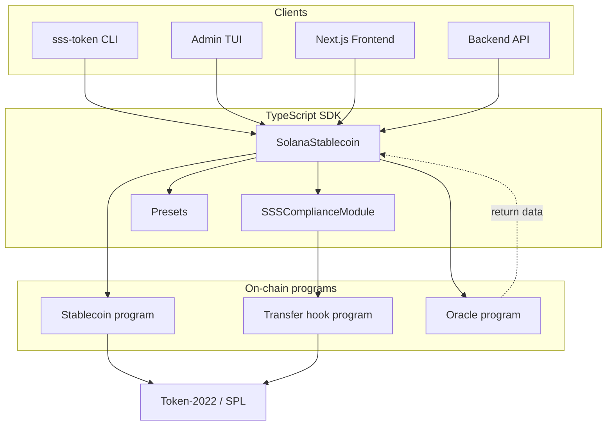

# Solana Stablecoin Standard (SSS)

Reference implementation of the Solana Stablecoin Standard: a configurable Token-2022 stablecoin with optional compliance (freeze, blacklist, seize) and three presets — **SSS-1** (minimal), **SSS-2** (compliant), and **SSS-3** (allowlist-gated confidential).

## Overview

- **Base program** (`stablecoin`): Initialize mint, config, roles; mint/burn, freeze/thaw, pause/unpause; minter management; optional blacklist and seize (SSS-2).
- **Transfer hook program** (`transfer_hook`): Validates transfers against blacklist when compliance is enabled.
- **Oracle program** (`oracle`): Computes mint / redeem amounts from Switchboard prices; separate pricing module (no CPI from stablecoin).
- **TypeScript SDK** (`@stbr/sss-token`): Create/load stablecoins, operations, presets, compliance module.
- **Admin CLI** (`sss-token`): Init, mint, burn, freeze, thaw, pause, blacklist, seize, status, supply, minters.
- **Admin TUI** (`sss-tui`): Interactive terminal UI (Ink) for status, mint, burn, freeze/thaw, pause/unpause, blacklist, allowlist, seize.
- **Example frontend** (`frontend`): Next.js app using the SDK — tabbed UI (Overview, Create, Compliance, Admin, Audit), wallet connect, mint picker (directory modal backed by `/api/getmints`), status, balance, transfer, screening, blacklist/allowlist/seize, configure minter, mint/burn, freeze/pause, and authority-aware banners when the connected wallet is not the master authority.

## Quick start

**Prerequisites:** Node.js, Yarn, Anchor, Solana CLI. Build programs and SDK from repo root:

```bash
anchor build
cd sdk && yarn build
cd ../cli && yarn install && yarn build
```

**Initialize (SSS-1, no compliance):**

```bash
yarn cli init --preset sss-1 -n "My Coin" -s MCOIN -u "https://example.com/mcoin" -d 6
# Output: mint, configPda, signature
```

**Initialize (SSS-2, with transfer hook + blacklist):**

```bash
yarn cli init --preset sss-2 -n "Compliant Coin" -s CCOIN -u "https://example.com/ccoin" -d 6
```

**Mint, status, supply:**

```bash
yarn cli mint <RECIPIENT_PUBKEY> 1000 -m <MINT_ADDRESS>
yarn cli status -m <MINT_ADDRESS>
yarn cli supply -m <MINT_ADDRESS>
```

Use `--rpc-url`, `--keypair`, and `--json` as needed. Run from repo root so `target/idl/*.json` and (optional) `Anchor.toml` resolve.

**Interactive Admin TUI:**

```bash
# From repo root; set mint so the TUI can perform actions
export SSS_MINT_ADDRESS=<MINT_ADDRESS>   # optional if only viewing status after selecting mint
yarn tui
# Or: cd admin-tui && yarn build && yarn start
```

Use arrow keys and Enter to choose actions (Status, Mint, Burn, Freeze/Thaw, Pause/Unpause, Blacklist, Allowlist, Seize). Press **q** or **Esc** to go back. Requires `KEYPAIR_PATH` and `RPC_URL` (or defaults); `anchor build` must have been run so IDLs exist.

**Example frontend (Next.js):**

```bash
anchor build && yarn copy-idl   # Copy IDL into frontend/public/idl
yarn frontend:dev               # Start dev server
```

Open the app, connect a wallet, paste the mint address, and use the UI for status, balance, and transfers. See [frontend/README.md](frontend/README.md).

**Backend (Docker):**

Run `anchor build` before `docker compose build` so `target/idl` exists (the image copies IDLs and SDK). Then:

```bash
docker compose up
```

Backend serves on port 3000 (mint/burn, compliance, health, audit). See [docs/API.md](docs/API.md) and [backend/README.md](backend/README.md).

## Program IDs (devnet / localnet)

Default RPC is **devnet** (`https://api.devnet.solana.com`). CLI, TUI, backend, and frontend use these program IDs (same on devnet and localnet for this repo):

| Program       | ID (devnet and localnet)                       |
| ------------- | ---------------------------------------------- |
| stablecoin    | `3zFReCtrBsjMZNabaV4vJSaCHtTpFtApkWMjrr5gAeeM` |
| transfer_hook | `4VKhzS8cyVXJPD9VpAopu4g16wzKA6YDm8Wr2TadR7qi` |
| oracle        | `4xvrXEAm7HKMdgcNehGth4QvRVArJHrfhnrC4gWZfvVu` |

For local tests run `anchor test` (starts a local validator). For devnet deployment proof and example tx links, see [DEPLOYMENT.md](docs/DEPLOYMENT.md).

## Preset comparison

| Feature                                  | SSS-1 | SSS-2 | SSS-3 |
| ---------------------------------------- | ----- | ----- | ----- |
| Token-2022 mint                          | ✅    | ✅    | ✅    |
| Freeze / thaw                            | ✅    | ✅    | ✅    |
| Pause / unpause                          | ✅    | ✅    | ✅    |
| Permanent delegate                       | ❌    | ✅    | ✅    |
| Transfer hook                            | ❌    | ✅    | ✅    |
| Blacklist / seize                        | ❌    | ✅    | ✅    |
| Confidential transfers                   | ❌    | ❌    | ✅    |
| Allowlist (transfer + confidential gate) | ❌    | ❌    | ✅    |

See [SSS-1.md](docs/SSS-1.md), [SSS-2.md](docs/SSS-2.md), and [SSS-3.md](docs/SSS-3.md) for specs.

## Architecture (high level)



- [ARCHITECTURE.md](docs/ARCHITECTURE.md) — Layer model, PDAs, security.
- [SDK.md](docs/SDK.md) — SDK usage and examples.
  - Includes `sdk/src/oracle.ts` helper for reading oracle return data.
- [OPERATIONS.md](docs/OPERATIONS.md) — Operator runbook and CLI reference.
- [COMPLIANCE.md](docs/COMPLIANCE.md) — Regulatory and audit considerations.
- [API.md](docs/API.md) — Backend API reference.
- [DEPLOYMENT.md](docs/DEPLOYMENT.md) — Devnet deployment and proof (Program IDs + example tx links).
- [SECURITY.md](docs/SECURITY.md) — Access control, error codes, mitigations.
- [TESTING.md](docs/TESTING.md) — How to run tests and filter by preset.
- [SSS-1.md](docs/SSS-1.md), [SSS-2.md](docs/SSS-2.md), [SSS-3.md](docs/SSS-3.md) — Preset specs.

## Tests

```bash
anchor test
```

Runs integration tests (SSS-1, SSS-2, and SSS-3 flows) and unit-style error cases. Requires a local validator. See [TESTING.md](docs/TESTING.md) for describe blocks and filter examples (e.g. `--grep "SSS-3: Allowlist"`).

## Project structure

```
solana-stablecoin-standard/
├── programs/
│   ├── stablecoin/          # Configurable stablecoin (SSS-1, SSS-2, SSS-3)
│   ├── transfer_hook/       # Blacklist + allowlist check on transfer (SSS-2, SSS-3)
│   └── oracle/              # Oracle Integration Module (Switchboard-based pricing)
├── sdk/                     # @stbr/sss-token (presets, core, compliance, confidential)
├── cli/                     # sss-token admin CLI
├── admin-tui/               # SSS Admin TUI (Ink) — status, mint, burn, freeze, pause, blacklist, allowlist, seize
├── frontend/                # Example Next.js UI — wallet, mint status, balance, transfer (uses @stbr/sss-token)
├── backend/                 # Mint/burn + compliance REST API, screening
├── tests/
│   ├── context.ts           # Shared test context (provider, programs, keypairs)
│   ├── stablecoin.test.ts   # Test runner (registers all suites)
│   └── suites/              # Per-area describe blocks (sss2-vanilla, sss1-integration, sss3-allowlist, unit-*, sdk-unit)
├── docs/
│   ├── ARCHITECTURE.md
│   ├── SDK.md
│   ├── ORACLE.md
│   ├── OPERATIONS.md
│   ├── SSS-1.md, SSS-2.md, SSS-3.md
│   ├── COMPLIANCE.md
│   ├── API.md
│   ├── DEPLOYMENT.md
│   ├── SECURITY.md
│   └── TESTING.md
├── docker-compose.yml       # Backend service + healthcheck
└── Anchor.toml
```

## License

MIT.
