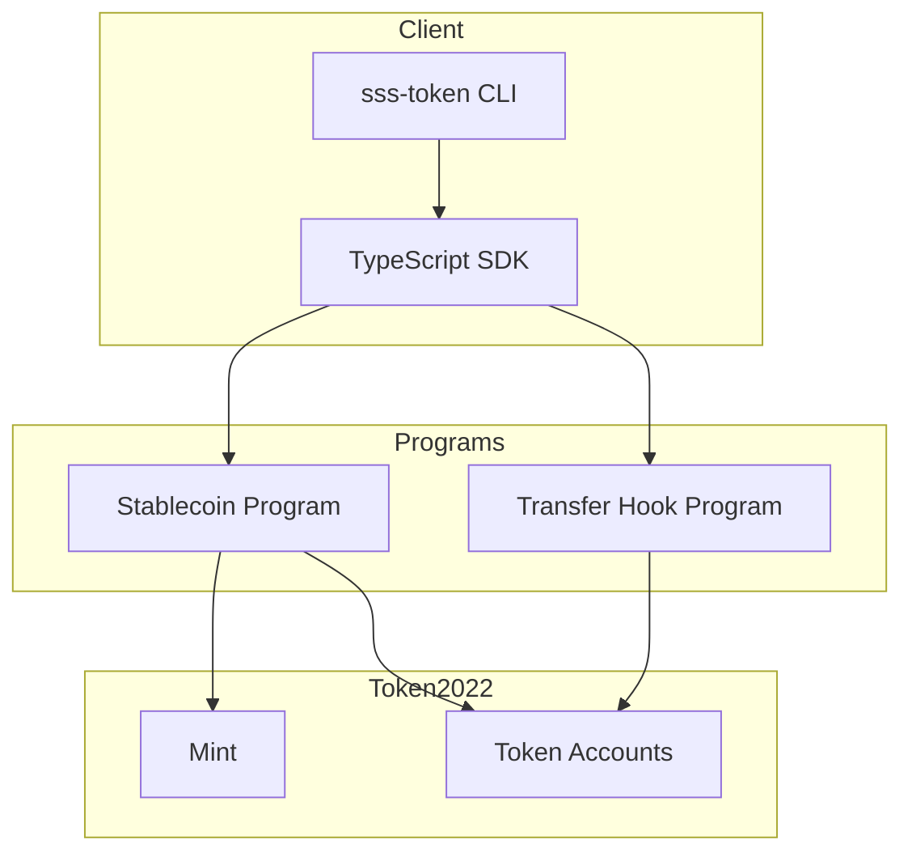

# Architecture — Solana Stablecoin Standard

## Layer model

| Layer          | Description                          | Artifacts                                                                          |
| -------------- | ------------------------------------ | ---------------------------------------------------------------------------------- |
| **L1 Base**    | Core stablecoin program + Token-2022 | `programs/stablecoin`, config/roles/minter PDAs                                    |
| **L2 Modules** | Optional extensions                  | Transfer hook program, blacklist PDAs, seize CPI                                   |
| **L3 Presets** | Predefined configs                   | SSS-1 (no hook), SSS-2 (hook + blacklist), SSS-3 (hook + allowlist + confidential) |

## Data flows

### Initialize

1. Authority calls `initialize(symbol, name, uri, decimals, flags)`.
2. Program derives mint PDA `["mint", symbol]`, config PDA `["config", mint]`, roles PDA `["roles", mint]`.
3. Creates Token-2022 mint (with freeze extension; optional permanent delegate and transfer hook).
4. Writes `StablecoinConfig` and `RoleAccount`; optionally configures minters.
5. For SSS-2: authority calls transfer-hook `initialize_extra_account_meta_list` so transfers include blacklist accounts.

### Mint / Burn

- **Mint:** Requires signer in minter set, optional daily quota check. Mints to recipient ATA.
- **Burn:** Requires burner role. Burns from specified account (default: keypair ATA).

### Freeze / Thaw

- **Freeze / Thaw:** Require pauser role. Operate on token accounts via Token-2022 freeze extension.

### Pause / Unpause

- **Pause / Unpause:** Require pauser role. Set `config.is_paused`; instructions check this and fail when paused.

### Transfer (SSS-2 / SSS-3)

1. User sends Token-2022 transfer (with hook).
2. Transfer hook program runs; reads extra-account-metas (blacklist PDAs; for SSS-3 also allowlist PDAs).
3. Hook checks sender and receiver against blacklist; if either is blacklisted, transfer fails. When allowlist is enabled (SSS-3), source and destination must be on the allowlist.

### Blacklist / Seize (SSS-2)

- **Add/remove blacklist:** Blacklister role; writes to transfer-hook BlacklistEntry PDAs.
- **Seize:** Seizer role; CPIs to Token-2022 transfer (with hook) from target account to treasury.

## PDAs and seeds

| Account               | Program       | Seeds                                             |
| --------------------- | ------------- | ------------------------------------------------- |
| Mint                  | stablecoin    | `["mint", symbol]`                                |
| Config                | stablecoin    | `["config", mint]`                                |
| Roles                 | stablecoin    | `["roles", mint]`                                 |
| Minter                | stablecoin    | `["minter", mint, minter_pubkey]`                 |
| BlacklistEntry (hook) | transfer_hook | Defined in hook; resolved via extra-account-metas |
| AllowlistEntry        | stablecoin    | `["allowlist", mint, wallet]` (SSS-3)             |

## Config account (on-chain)

`StablecoinConfig` is stored at the config PDA and includes:

- **Identity:** `name`, `symbol`, `uri` (strings, max lengths 64 / 16 / 256 bytes). Set at initialize; useful for indexers and UIs.
- **Authority and mint:** `master_authority`, `mint`, `bump`, `decimals`.
- **Flags:** `is_paused`, `enable_permanent_delegate`, `enable_transfer_hook`, `enable_confidential_transfers`, `enable_allowlist`.
- **default_account_frozen:** Boolean policy flag stored on-chain. When true, it indicates the issuer’s policy that new token accounts may start frozen; it is not wired to Token-2022 default account state in this implementation. Used for documentation and future extension.

Existing configs deployed before this layout may have empty name/symbol/uri when read.

## Security model

- **Roles:** Single PDA holds burner, pauser, blacklister, seizer. Update via `update_roles` (master authority).
- **Feature gating:** Compliance instructions (blacklist, seize) fail with `ComplianceNotEnabled` if `enable_transfer_hook` is false.
- **Pause:** When `is_paused` is true, mint/burn/freeze/thaw and other mutating instructions are blocked.
- **Transfer hook:** Only runs when mint has transfer-hook extension; hook validates blacklist using accounts provided by extra-account-metas.

## Diagram (Mermaid)

