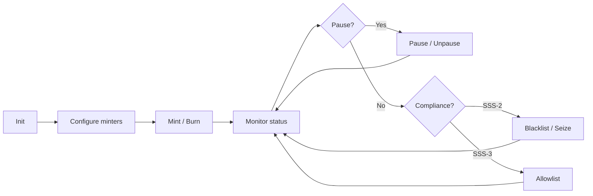

# Operations — Operator runbook and CLI reference

Run the CLI from the **repo root** with `yarn cli` (or `node cli/dist/index.js`). Ensure `target/idl/*.json` exists (`anchor build`).

## First-time setup

Follow this flow to build, initialize a stablecoin, and mint for the first time:

**Step 1 — Build programs and tools:**

```bash
anchor build
cd sdk && yarn build
cd cli && yarn build
```

**Step 2 — Initialize a stablecoin (SSS-2 example):**

```bash
yarn cli init --preset sss-2 -n "My Coin" -s MCOIN -u "https://example.com" -d 6
```

Save the output `mint` address for later commands.

**Step 3 — Add yourself as minter (if not auto-added):**

The init keypair is usually the master and may already be a minter. If mint fails with `MinterInactive`, add your keypair:

```bash
yarn cli minters add <YOUR_PUBKEY> -m <MINT> --quota 1000000
```

**Step 4 — Mint to a recipient:**

The CLI creates the recipient's Associated Token Account (ATA) if it does not exist:

```bash
yarn cli mint <RECIPIENT> <AMOUNT> -m <MINT>
```

### Troubleshooting

| Error | Cause | Fix |
|-------|-------|-----|
| **AccountNotInitialized** | Recipient ATA missing | The CLI now creates ATAs automatically. Ensure you're on the latest build. If it still fails, create the ATA manually: `spl-token create-account <MINT> --owner <RECIPIENT>` |
| **MinterInactive** | Your keypair is not an authorized minter | Add yourself: `yarn cli minters add <YOUR_PUBKEY> -m <MINT> --quota 1000000` |
| **ProgramPaused** | Mint/burn/freeze/thaw are disabled | Unpause first: `yarn cli unpause -m <MINT>` |

## Admin TUI (interactive)

From repo root:

```bash
export SSS_MINT_ADDRESS=<MINT_ADDRESS>   # required for mint/burn/freeze/etc.
export KEYPAIR_PATH=~/.config/solana/id.json
export RPC_URL=https://api.devnet.solana.com   # or http://127.0.0.1:8899 for local validator
yarn tui
```

Or from `admin-tui`: `yarn build && yarn start` (or `yarn dev` with tsx). The TUI uses the same keypair and RPC as the CLI. Screens: **Status** (config, supply, roles), **Mint**, **Burn**, **Freeze**, **Thaw**, **Pause**, **Unpause**, **Blacklist** (SSS-2 add/remove), **Allowlist** (SSS-3 add/remove), **Seize** (SSS-2). Use arrow keys + Enter to select; **q** or **Esc** to go back.

## Global options

| Option | Description | Default |
|--------|-------------|---------|
| `-k, --keypair <path>` | Keypair for signer | `~/.config/solana/id.json` |
| `--rpc-url <url>` | RPC endpoint | `https://api.devnet.solana.com` (set to `http://127.0.0.1:8899` for local validator) |
| `--json` | Output JSON | — |

## Init

**Preset (SSS-1 or SSS-2):**

```bash
yarn cli init --preset sss-1 -n "My Coin" -s MCOIN -u "https://example.com/mcoin" -d 6
yarn cli init --preset sss-2 -n "Compliant" -s CCOIN -u "https://example.com/ccoin" -d 6
```

**Custom config (TOML file):**

```bash
yarn cli init --custom path/to/config.toml
```

TOML keys: `name`, `symbol`, `uri`, `decimals`, `enable_permanent_delegate`, `enable_transfer_hook`, `default_account_frozen`.

Output: `mint`, `configPda`, `signature`; for SSS-2 also `transferHookInitSignature`.

## Operations (require `-m, --mint <address>`)

| Command | Description | Example |
|---------|-------------|---------|
| `mint <recipient> <amount>` | Mint to recipient | `yarn cli mint <PUBKEY> 1000 -m <MINT>` |
| `burn <amount>` | Burn from keypair ATA | `yarn cli burn 100 -m <MINT>` |
| `burn <amount> --from <address>` | Burn from another ATA | `yarn cli burn 50 -m <MINT> --from <ATA>` |
| `freeze <address>` | Freeze token account | `yarn cli freeze <ATA> -m <MINT>` |
| `thaw <address>` | Thaw token account | `yarn cli thaw <ATA> -m <MINT>` |
| `pause` | Pause all operations | `yarn cli pause -m <MINT>` |
| `unpause` | Unpause | `yarn cli unpause -m <MINT>` |
| `status` | Config, supply, roles | `yarn cli status -m <MINT>` |
| `supply` | Total supply only | `yarn cli supply -m <MINT>` |
| `roles update` | Set burner/pauser/blacklister/seizer (master only) | `yarn cli roles -m <MINT> update --burner <PUBKEY>` |
| Transfer authority | Not in CLI; use SDK/program: `transfer_authority(new_authority)` | See [SDK.md](SDK.md) |

## SSS-2 compliance

| Command | Description | Example |
|---------|-------------|---------|
| `blacklist add <address>` | Add to blacklist | `yarn cli blacklist add <PUBKEY> -m <MINT> -r "reason"` |
| `blacklist remove <address>` | Remove from blacklist | `yarn cli blacklist remove <PUBKEY> -m <MINT>` |
| `seize <from> -t <treasury>` | Seize to treasury | `yarn cli seize <FROM_ATA> -m <MINT> -t <TREASURY> [-a amount]` |

## Management

| Command | Description | Example |
|---------|-------------|---------|
| `minters list` | List minters (info) | `yarn cli minters -m <MINT> list` |
| `minters add <pubkey>` | Add minter | `yarn cli minters -m <MINT> add <PUBKEY> [-q quota]` |
| `minters remove <pubkey>` | Deactivate minter | `yarn cli minters -m <MINT> remove <PUBKEY>` |
| `holders` | Stub (use RPC/getTokenLargestAccounts) | — |
| `audit-log` | Stub (requires indexer) | — |

## Runbook summary



1. **Init:** Choose preset or custom; run `init`; record mint and configPda.
2. **Mint:** Use a keypair that is an authorized minter (or add one via `minters add`).
3. **Freeze / Thaw:** Use pauser keypair; specify token account address.
4. **Pause:** Use pauser; blocks mint/burn/freeze/thaw until unpause.
5. **Blacklist (SSS-2):** Use blacklister; add/remove addresses; transfers involving those addresses will fail.
6. **Seize (SSS-2):** Use seizer; specify source account and treasury; optional amount (default full balance).

All commands support `--json` for scripting.
