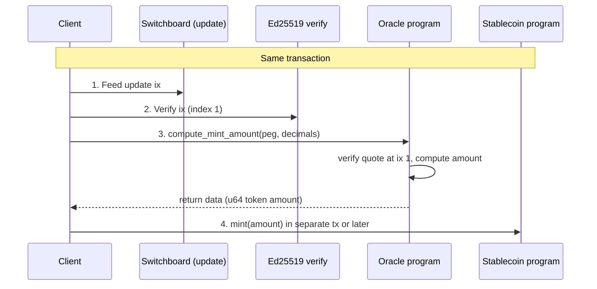

# Oracle Integration Module

The Oracle Integration Module is a **separate Anchor program** that provides
**peg-based mint and redeem pricing**: it computes how many stablecoin tokens
to mint (or burn) for a given peg amount (e.g. 1 USD) using verified
Switchboard prices. Clients call the oracle, read the computed amount from
return data, then call the stablecoin program’s existing mint/burn
instructions. The core stablecoin program is not tied to any oracle vendor.

- Program name: `oracle`
- Program ID (devnet): `4xvrXEAm7HKMdgcNehGth4QvRVArJHrfhnrC4gWZfvVu`
- Location: `programs/oracle`

The oracle program:

- Reads a verified Switchboard quote from the **same transaction** using the
  `switchboard-on-demand` crate.
- Enforces a staleness bound (default: 150 slots) on the quote.
- Computes a token amount from a peg amount and token decimals.
- Returns the result via Solana **return data** (little-endian `u64`).

The stablecoin program remains SSS-1/SSS-2; it does **not** CPI into the
oracle program. Instead, **clients** (backend, CLI, or other programs)
call the oracle, read the computed amount, and then call the existing
mint / burn instructions on the stablecoin program.

---

## Instructions

All instructions share the same accounts:

- `queue`: Switchboard queue account for the feed being used.
- `slot_hashes`: `SYSVAR_SLOT_HASHES_PUBKEY`
- `instructions`: `SYSVAR_INSTRUCTIONS_PUBKEY` (must contain the Switchboard
  Ed25519 verify instruction at index 1).

### `read_feed`

```text
read_feed(queue, slot_hashes, instructions)
```

Reads a verified Switchboard quote and logs the feed value(s) with `msg!`.
Primarily useful for debugging and integration testing.

### `compute_mint_amount`

```text
compute_mint_amount(queue, slot_hashes, instructions, peg_amount: u64, token_decimals: u8)
```

Computes the number of stablecoin tokens to **mint** for a given peg amount.

- `peg_amount`: amount in smallest peg units (e.g. `100_000_000` for `100.000000`).
- `token_decimals`: decimals of the stablecoin mint (0–18).

The program:

1. Verifies there is a valid Switchboard quote in the same transaction
   (Ed25519 instruction at index 1).
2. Enforces that price is strictly greater than zero.
3. Computes:

   \[
   \text{token\_amount} = \frac{\text{peg\_amount} \times 10^{\text{token\_decimals}}}{\text{price}}
   \]

4. Checks for numeric overflow and bounds.
5. Writes `token_amount` as little-endian `u64` to return data.

### `compute_redeem_amount`

```text
compute_redeem_amount(queue, slot_hashes, instructions, peg_amount: u64, token_decimals: u8)
```

Same interface and behavior as `compute_mint_amount`, but intended for
**redeem / burn** flows. The caller uses the returned amount as the burn
amount for the stablecoin program.

---

## Error handling

The oracle program defines a small error set:

- `InvalidFeed`: no feed or invalid quote.
- `ZeroPrice`: feed price is zero or could not be converted.
- `Overflow`: numeric overflow / out-of-range result.

Errors are surfaced through normal Anchor error codes and logs.

---

## Transaction flow



The oracle relies on a specific **instruction ordering** contract:

1. Switchboard update instruction for the chosen feed.
2. Switchboard Ed25519 verify instruction for that update.
3. Oracle instruction (`read_feed`, `compute_mint_amount`, or `compute_redeem_amount`).

The oracle uses `switchboard-on-demand` to locate and validate the quote
using the **instructions sysvar** and enforces a maximum age (default:
`MAX_STALENESS_SLOTS = 150`).

---

## Client usage (high level)

At a high level, a client (backend, CLI, or another program) does:

1. Build Switchboard update + verify instructions for the desired feed.
2. Add the oracle `compute_mint_amount` or `compute_redeem_amount` instruction.
3. Simulate or send the transaction.
4. Read the oracle program's return data (little-endian `u64`).
5. Call the stablecoin program's mint / burn instruction with that amount.

The repo includes:

- A minimal **TypeScript helper** in `sdk/src/oracle.ts` that:
  - Builds a transaction containing optional pre-instructions (e.g. the
    Switchboard instructions) plus the oracle instruction.
  - Uses `simulateTransaction` to read the oracle return data.

The helper deliberately does **not** depend on any Switchboard client
packages; it expects the caller to construct any Switchboard-specific
instructions and pass them as `preInstructions`.

---

## Costs and networks

For this submission:

- The oracle module is designed to work on **devnet** with Switchboard
  devnet feeds.
- Devnet usage is free; there is no on-chain fee beyond normal Solana
  compute / transaction fees.

In production, you would:

- Use production Switchboard feeds and queues.
- Run the same flow on mainnet-beta.

Switchboard on-demand is **pay-per-use**: ~0.00015 SOL per quote when the
transaction is sent. No subscription or upfront feed funding.

---

## Browser flow (user pays)

For a browser flow where the **user** signs and pays (no backend key):

1. Frontend gets Switchboard update + verify instructions from
   `@switchboard-xyz/on-demand` (queue + feed ID).
2. Ensure the **Ed25519 verify** instruction is at **index 1** in the tx
   (reorder if the SDK returns them differently).
3. Build tx: `[Switchboard ix 0, Switchboard ix 1, oracle compute_mint_amount]`,
   then simulate and read return data (u64 token amount), or include a mint
   instruction in a second step using that amount.
4. User signs and sends; user pays tx fees + quote cost.

In the example frontend, set `NEXT_PUBLIC_SWITCHBOARD_QUEUE` and
`NEXT_PUBLIC_SWITCHBOARD_FEED_HASH` in `.env` (see `frontend/.env.example`).

**Config checklist:**

| Item | Where / value |
|------|----------------|
| Oracle program ID | Deployed program (e.g. devnet `4xvrXEAm7HKMdgcNehGth4QvRVArJHrfhnrC4gWZfvVu`). |
| Switchboard queue | Queue pubkey for the feed ([Switchboard Explorer](https://ondemand.switchboard.xyz/)). |
| Feed ID / feed hash | 32-byte feed identifier for the desired price (e.g. EUR/USD). |
| Sysvars | `SYSVAR_SLOT_HASHES_PUBKEY`, `SYSVAR_INSTRUCTIONS_PUBKEY`. |
| Private key | None in frontend; user signs with wallet. |

See `docs/plans/2025-02-27-browser-oracle-mint-design.md` for full design and
implementation notes.

