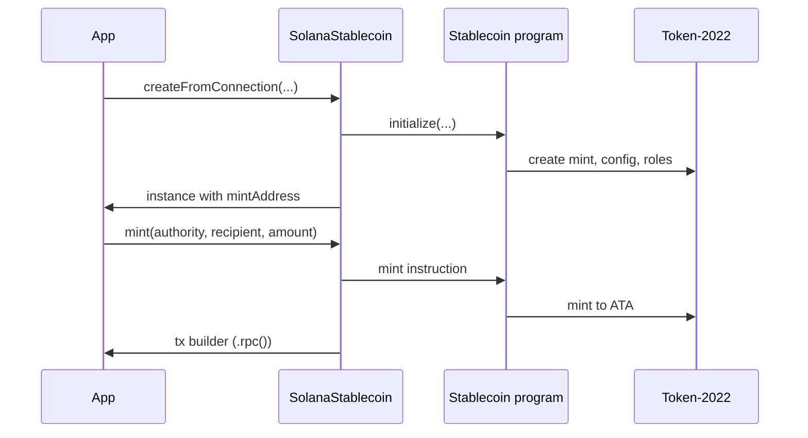

# SDK — TypeScript usage

The SDK (`@stbr/sss-token`) provides a typed client for the stablecoin and transfer-hook programs.

## Installation

From the repo (after `anchor build` and SDK build):

```ts
import {
  SolanaStablecoin,
  SSSComplianceModule,
  SSS_1_PRESET,
  SSS_2_PRESET,
  type StablecoinConfig,
} from "@stbr/sss-token";
```

Use the workspace package or `file:../sdk` in your app.

## Presets and custom config

**Presets** (no name/symbol/uri/decimals; you supply those):

- `SSS_1_PRESET` / `Presets.SSS_1`: `{ enablePermanentDelegate: false, enableTransferHook: false }`
- `SSS_2_PRESET` / `Presets.SSS_2`: `{ enablePermanentDelegate: true, enableTransferHook: true }`
- `SSS_3_PRESET` / `Presets.SSS_3`: confidential + allowlist (POC)

**Quick start** (preset init + operations + compliance):

```ts
import {
  SolanaStablecoin,
  SSSComplianceModule,
  Presets,
} from "@stbr/sss-token";

// Preset initialization
const stable = await SolanaStablecoin.createFromConnection(connection, {
  preset: "sss-2",
  name: "My Stablecoin",
  symbol: "MYUSD",
  decimals: 6,
  authority: adminKeypair,
});

// Or custom config
const custom = await SolanaStablecoin.createFromConnection(connection, {
  name: "Custom Stable",
  symbol: "CUSD",
  decimals: 6,
  authority: adminKeypair,
  config: {
    name: "Custom Stable",
    symbol: "CUSD",
    uri: "https://example.com",
    decimals: 6,
    ...Presets.SSS_2,
  },
});

// Operations
await stable
  .mint(adminKeypair.publicKey, recipient, 1_000_000)
  .then((tx) => tx.rpc());
const compliance = new SSSComplianceModule(stable);
await compliance
  .addToBlacklist(adminKeypair.publicKey, address, "Sanctions match")
  .then((tx) => tx.rpc()); // SSS-2
await compliance
  .seize(adminKeypair.publicKey, frozenAccount, treasury, amount)
  .then((tx) => tx.rpc()); // SSS-2
const supply = await stable.getTotalSupply();
```

**Full config** (for init):

```ts
const config: StablecoinConfig = {
  name: "My Coin",
  symbol: "MCOIN",
  uri: "https://example.com/mcoin",
  decimals: 6,
  ...SSS_2_PRESET,
};
```

## Create and load

**SDK create + mint flow:**



**Create from Connection** (Node: loads IDL from `target/idl`; matches req example):

```ts
import { SolanaStablecoin } from "@stbr/sss-token";

const stable = await SolanaStablecoin.createFromConnection(connection, {
  preset: "sss-2",
  name: "My Stablecoin",
  symbol: "MYUSD",
  decimals: 6,
  authority: adminKeypair,
});
// Or preset "sss-1", or pass config: { ... } for full custom.
// In browser, pass idl: { stablecoin, transferHook? } or use create(program, ...).
```

**Create** (when you already have Program instances):

```ts
const sdk = await SolanaStablecoin.create(
  program, // Anchor Program<Stablecoin>
  authority, // PublicKey
  config,
  transferHookProgram, // optional Program<TransferHook>
);
// sdk.mintAddress is set
```

**Load** (bind to existing mint):

```ts
const sdk = SolanaStablecoin.load(program, mintAddress, transferHookProgram);
```

## Operations

Assume `sdk` is a `SolanaStablecoin` with `mintAddress` set.

- **Mint:** `sdk.mint(authority, recipient, amount)` → returns instruction builder (e.g. `.rpc()`).
- **Burn:** `sdk.burn(authority, from, amount)`.
- **Freeze / Thaw:** `sdk.freeze(pauser, accountToFreeze)`, `sdk.thaw(pauser, accountToThaw)`.
- **Pause / Unpause:** `sdk.pause(pauser)`, `sdk.unpause(pauser)`.
- **Update minter:** `sdk.updateMinter(authority, minterPubkey, active, dailyQuota)`.
- **Update roles:** `sdk.updateRoles(authority, { burner?, pauser?, blacklister?, seizer? })` — pass a `PublicKey` for each role you want to set; omit or pass `null` to leave unchanged. To revoke a role, set it to the master authority pubkey.
- **Transfer authority:** The program exposes `transfer_authority(new_authority)`. The current master authority signs; the config’s `master_authority` is updated. No SDK wrapper; use `program.methods.transferAuthority(newAuthorityPubkey).accounts({ admin, config, mint }).rpc()` (see tests/suites/unit-success.ts). Use for atomic handover of the top-level admin.

## View methods

- `sdk.getTotalSupply()` → `BN` (total supply).
- `sdk.getConfig()` → `StablecoinConfigAccount` (decimals, isPaused, flags, masterAuthority, mint, **name**, **symbol**, **uri**, **defaultAccountFrozen**, etc.).
- `sdk.getRoles()` → `RoleAccountData` (burner, pauser, blacklister, seizer).

## Compliance (SSS-2)

```ts
const compliance = new SSSComplianceModule(sdk);
// After init, run once to set extra-account-metas for the mint:
await compliance
  .initializeTransferHookExtraAccounts(authority)
  .then((tx) => tx.rpc());
// Then:
compliance.addToBlacklist(blacklister, address); // optional 3rd arg: reason (audit only, not on-chain)
compliance.removeFromBlacklist(blacklister, address);
compliance.seize(seizer, fromAccount, treasury, amount);
```

## Oracle helper (optional)

For non-USD pegs (e.g. EUR, BRL, CPI-indexed), the repo includes a separate
**Oracle Integration Module** (`oracle` program) that computes mint / redeem
amounts from Switchboard prices. The core stablecoin program never CPI-calls
this module; instead, **clients** call the oracle and then pass the computed
amount into the existing `mint` / `burn` instructions.

The SDK exposes a small helper in `sdk/src/oracle.ts`:

```ts
import type {
  Connection,
  PublicKey,
  TransactionInstruction,
} from "@solana/web3.js";
import {
  SYSVAR_SLOT_HASHES_PUBKEY,
  SYSVAR_INSTRUCTIONS_PUBKEY,
} from "@solana/web3.js";
import { Program } from "@coral-xyz/anchor";
import type { Oracle } from "../target/types/oracle";
import { computeMintAmountFromOracle } from "@stbr/sss-token";

// Example shape – you must construct Switchboard-specific instructions yourself.
async function quoteMintAmountFromOracle(params: {
  connection: Connection;
  oracleProgram: Program<Oracle>;
  queue: PublicKey;
  pegAmount: bigint; // e.g. 100_000_000n for 100.000000
  tokenDecimals: number; // e.g. 6
  preInstructions: TransactionInstruction[]; // Switchboard update + Ed25519 verify
}): Promise<bigint> {
  const {
    connection,
    oracleProgram,
    queue,
    pegAmount,
    tokenDecimals,
    preInstructions,
  } = params;

  const amount = await computeMintAmountFromOracle({
    connection,
    program: oracleProgram,
    queue,
    slotHashes: SYSVAR_SLOT_HASHES_PUBKEY,
    instructionsSysvar: SYSVAR_INSTRUCTIONS_PUBKEY,
    pegAmount,
    tokenDecimals,
    preInstructions,
  });

  return amount;
}
```

See [ORACLE.md](./ORACLE.md) for full details on the oracle program, expected
instruction ordering, and how to build the Switchboard pre-instructions.

## PDA helpers

- `SolanaStablecoin.getMintPDA(symbol, programId)`
- `SolanaStablecoin.getConfigPDA(mint, programId)`

Use these to compute addresses before or without loading the full SDK instance.
