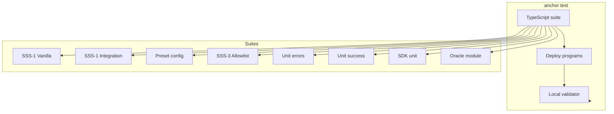

# Testing — SSS

## Run all tests

From repo root:

```bash
anchor test
```

Starts a local validator, deploys the stablecoin, transfer_hook, and oracle programs, then runs the TypeScript test suite. Expect ~1–2 minutes; 53 tests (SSS-1/SSS-2/SSS-3 flows, preset config, unit error/success cases, SDK unit tests including PDA derivation, presets, buildMintInstructions, oracle module).

## Test stack



## Test layout

Tests are modular: **`tests/stablecoin.test.ts`** is the runner (shared context + airdrop); **`tests/context.ts`** defines the test context; **`tests/suites/*.ts`** each register one describe block.

| Describe block                                           | What it covers                                                                                                                                                                                                              |
| -------------------------------------------------------- | --------------------------------------------------------------------------------------------------------------------------------------------------------------------------------------------------------------------------- |
| **SSS-1: Vanilla Stablecoin Operations**                 | SSS-2 preset: init, transfer-hook init, mint, transfer with hook, blacklist add, blocked transfer, seize, thaw, pause/unpause                                                                                               |
| **SSS-1: integration (mint → transfer → freeze → thaw)** | SSS-1 preset: init (no hook), mint, plain SPL transfer, freeze, thaw                                                                                                                                                        |
| **Preset config tests**                                  | SSS-1/SSS-2 config flags (enableTransferHook, enablePermanentDelegate) via getConfig()                                                                                                                                      |
| **SSS-3: Allowlist (POC)**                               | Confidential + allowlist preset, hook extra accounts, add/remove allowlist, transfer blocked then allowed; getConfidential / fundConfidential allowlist gate, deposit and applyPending instruction building                 |
| **Unit: instruction error cases**                        | ComplianceNotEnabled, Unauthorized (burn), QuotaExceeded, MinterInactive, InvalidAmount, Paused (mint when paused)                                                                                                          |
| **Unit: instruction success cases**                      | update_roles, configure_minter, transfer_authority, freeze/thaw, remove_from_blacklist                                                                                                                                      |
| **SDK unit tests**                                       | getTotalSupply, getConfig, getRoles, SolanaStablecoin.load, buildMintInstructions; PDA derivation (getMintPDA, getConfigPDA, getRoleAccountPDA, getMinterPDA, blacklist/allowlist seeds); Presets (SSS_1/SSS_2/SSS_3 shape) |
| **Oracle module**                                        | compute_mint_amount fails without Switchboard instruction (smoke)                                                                                                                                                           |

## Trident fuzz

**`trident-tests/`** contains a Trident fuzz target for the stablecoin program (simulation-only: state tracked in Rust, invariants on supply and pause). Run from repo root:

```bash
cargo run -p trident-tests --bin fuzz_0
```

Or with Trident CLI: `cargo install trident-cli`, then `cd trident-tests && trident fuzz run fuzz_0 --timeout 300`. See **`trident-tests/README.md`** and [Trident docs](https://ackee.xyz/trident/docs/latest/).

## Filter by preset (Mocha grep)

```bash
# SSS-1 integration only
anchor test -- --grep "SSS-1: integration"

# SSS-2 flow (first describe)
anchor test -- --grep "SSS-1: Vanilla"

# Error cases only
anchor test -- --grep "Unit: instruction"
```

## Prerequisites

- Anchor CLI, Solana CLI, Node/yarn.
- `anchor build` must have been run so `target/idl/*.json` and program binaries exist.

## Backend tests

```bash
yarn test:backend
```

Runs Vitest for the backend (`backend/__tests__/health.test.ts`). Tests `GET /health` returns 200. See [API.md](API.md) and `backend/README.md`.

## Docker

Health check is exercised via `docker compose up` (GET /health).
